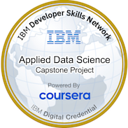
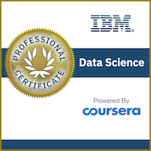

# Data Science Project - SpaceX

## Background
SpaceX, a leader in the space industry, strives to make space travel affordable for everyone. Its accomplishments include sending spacecraft to the international space station, launching a satellite constellation that provides internet access and sending manned missions to space.
SpaceX can do this because the rocket launches are relatively inexpensive ($62 million per launch) due to its novel reuse of the first stage of its Falcon 9 rocket. 
Other providers, which are not able to reuse the first stage, cost upwards of $165 million each. The price of the launch can be determined if the first stage can land successfully.
To do this, public data and machine learning models will be used to predict whether SpaceX – or a competing company – can reuse the first stage. 

This capstone project will demonstrate what data scientists go through when working with datasets. The role is that of a data scientist working for a startup intending to compete with SpaceX, and in the process following the data science methodology involving 
[data collection](Checkpoints/data_collection_checkpoint.ipynb), 
[data wrangling](Checkpoints/data_wrangling_checkpoint.ipynb),
[exploratory data analysis](Checkpoints/eda_with_sql_checkpoint.ipynb),
[data visualization](Checkpoints/eda_with_visualization_checkpoint.ipynb),
[model development](Checkpoints/visual_analytics_with_folium_checkpoint.ipynb),
[model evaluation](Checkpoints/machine_learning_predictive_analysis_checkpoint.ipynb),
and [reporting](https://github.com/soares921/Data_Science_Project_SpaceX/blob/main/SpaceX%20Data%20Science%20Presentation.pdf) results to stakeholders. The data scientist tasked with predicting if the first stage of the SpaceX Falcon 9 rocket will land successfully. 

## Objective
- To apply data science toolkit and machine learning in order to accurately predict the likelihood of the first stage rocket landing successfully, and thus determine the cost of a launch.
- Explore the data in order to obtain more insight from the data.

## Author
#### Marcos Soares

  

  
